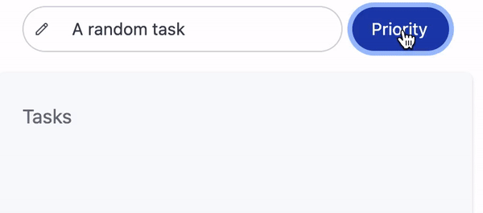

# KayTask
## Online Task Management App
### [View product: Here](https://urlr.app/kaytask)

## Technologies

## Features

- **Login via SSO** 
    

- **Kanban Board** 
    

- **Priority Based Task** 
    

- **Drag & Drop** 
    

- **Edit Tasks** 
    

- **Save Completed Task / Mark Incomplete** 
    

- **Edit Account Details** 
    
